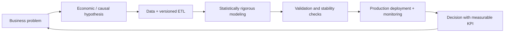

<!--
  SEO: Lead Data Scientist, Principal Data Scientist, Director of Data, Data Manager,
  Causal Inference, Econometrics, Reinforcement Learning, Scalable ML Systems, MLOps
-->

  

<h1 align="center">👋 Hi, I'm Jordán Villón</h1>
<h3 align="center">Principal Data Scientist | Lead Data Scientist | Director of Data | Data Manager</h3>

  
  
  
  
  
  
  
  
  

---

## About Me

I lead data science initiatives that connect rigorous modeling with measurable business outcomes. I work across strategy, experimentation, and production delivery, and I partner with engineering, product, and executive stakeholders to turn uncertainty into better decisions.

I am targeting roles where I can drive impact at scale as a **Lead Data Scientist**, **Principal Data Scientist**, **Director of Data**, or **Data Manager**.

---

## 💡 Value Statement

> I focus on decisions, not just models. I combine causal econometrics, machine learning, and reinforcement learning with clear business KPIs to deliver production impact.

With a foundation in **Statistics and Mathematics**, I build systems that start with an explicit business hypothesis, pass stability validation, and ship as monitored production services.

---

## 🎯 Strategic Focus Areas

| Area | What I deliver |
|---|---|
| **Causal Inference for Pricing & Economics** | Hedonic models, difference-in-differences, IV, and experiment design for pricing and policy decisions |
| **Forecasting at Scale** | Time-series pipelines (ARIMA/SARIMA, GAMs, DL) with uncertainty quantification and conformal prediction |
| **RL for Dynamic Optimization** | PPO/DDQN agents for biosecurity, operations, and resource allocation under uncertainty |
| **ML System Design** | ETL → Feature Store → API → Dashboard architectures with drift monitoring and governance |
| **Spatial Analytics** | H3 grids, spatial econometrics (Moran, LISA), and geostatistics for territory-level decisions |

---

## 🏆 Results with Metrics

- I have led teams of 8+ data scientists and ML engineers from strategic roadmap to production delivery.
- I have deployed production models with **p95 latency < 80 ms** and **99.9% availability**.
- I delivered **+150% ROI** in a computer vision disease detection system and **−25% pesticide usage** through earlier detection.
- I enabled **7–14 day early warnings** in aquaculture operations, with estimated avoided losses of **~$1.2M**.
- I built public governance indices covering **221 municipalities** for citizens, journalists, and decision-makers.
- I achieved an **18% error reduction** vs. baseline hedonic models in urban valuation.

---

## 🧰 Differentiated Stack

| **Hands-on (Modeling)** | **Architecture / MLOps** |
|---|---|
| Python, PyTorch, scikit-learn | MLflow (experiments and model registry) |
| Statsmodels (econometrics and causal inference) | Databricks + Apache Spark (scale processing) |
| LightGBM / XGBoost (quantile regression) | Airflow / versioned ETL scripts |
| Stable Baselines3 (RL) | Docker + docker-compose, CI/CD |
| Pandas / Polars / data.table | FastAPI, Redis, drift monitoring (PSI) |

---

## ⭐ Featured Projects

| Visual | Project | What it solves | Impact | Stack |
|---|---|---|---|---|
|  | [Urban Valuation Radar](https://github.com/jordanvt18/radar-valorizacion-urbana) | Predicts real estate appreciation for Quito and Guayaquil with confidence intervals | 18% lower error vs. baseline hedonic model; supports investment decisions | Geospatial ETL (H3), LightGBM quantile, CNN+MLP, FastAPI, Leaflet/Plotly |
|  | [Shrimp Biosecurity AI](https://github.com/jordanvt18/bioseguridad-camaron-AI) | Predicts disease outbreaks in shrimp ponds with DL+RL and an economic simulator | 7–14 day early warnings; estimated avoided losses ~$1.2M | LSTM/Transformer, Autoencoder, PPO, FastAPI, Docker |
|  | [Banana Disease Detection](https://github.com/jordanvt18/banana-disease-detection) | Detects banana crop diseases with computer vision | +150% ROI; −25% pesticide use; 5 s/image | PyTorch ResNet18, transfer learning, ONNX, Docker |
|  | [Transparency Index Ecuador](https://github.com/jordanvt18/transparency-index-ecuador) | Municipal transparency index with peer benchmarking | Coverage of 221 municipalities (2025); procurement anomaly detection | ETL, composite index, FastAPI, static frontend |
|  | [Political Professionalization Profile](https://github.com/jordanvt18/perfil-profesionalizacion-partidos-ecuador) | Professionalization index for candidates and political parties (Elections 2026) | 0–100 index by candidate, party, and province; reproducible analysis | ETL, NLP, FastAPI, interactive frontend, CI/CD |
|  | [Python Data Processing Benchmark](https://github.com/jordanvt18/python-data-processing-benchmark) | Reproducible benchmark: Pandas vs. Polars vs. data.table | Evidence-based time and memory trade-offs for stack decisions | Python, notebooks, pytest |
|  | [Banks & Cooperatives Ecuador](https://github.com/jordanvt18/bancos-cooperativas-ecuador) | Financial safety comparator for banks and cooperatives | Citizen-oriented financial education with auditable indicators | HTML/JS, data pipelines, GitHub Pages |
|  | [SmartLife Analyzer](https://github.com/jordanvt18/smartlife-analyzer) | Health analytics platform with model retraining workflows | Personalized risk scoring and holdout validation | Node.js, static dashboards |
|  | [Ecuador Crime Analysis](https://github.com/jordanvt18/ecuador-crime-analysis) | Spatial analytics and time-series modeling of crime (2014–2026) | 43,976 official records; ARIMA + composite indices | Python, spatial econometrics, Dash |
|  | [jordanvillont.github.io](https://github.com/jordanvt18/jordanvillont.github.io) | Professional portfolio with case studies and demos | Stronger executive and technical positioning | Jekyll (Minimal Mistakes), GitHub Actions |

---

## 🧭 How I Work

---

## 📫 Let's Connect

  
  
  

  <i>I build decision systems that transform uncertainty into competitive advantage.</i>

