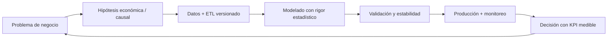

<!--
  SEO: Principal Data Scientist, Causal Inference, Econometrics, Reinforcement Learning,
  Scalable ML Systems, MLOps, Ecuador, Remote, Leadership
-->

  

<h1 align="center">👋 Hola, soy Jordán Villón</h1>
<h3 align="center">Principal Data Scientist | Lead | Bridging Econometrics, Causal Inference, RL &amp; Business Strategy</h3>

  
  
  
  
  
  
  
  
  

---

## 💡 Declaración de valor

> Mi filosofía: **los modelos no venden, las decisiones sí.** Conecto econometría causal y
> aprendizaje por refuerzo con KPIs de negocio medibles — cuantifico incertidumbre, la gestiono
> con rigor estadístico y escalo equipos y sistemas para que el valor llegue a producción.

Formado en **Estadística y Matemáticas**, trabajo en la intersección entre la inferencia causal,
la optimización dinámica y la ingeniería de ML en producción. Cada proyecto que lidero parte de
una hipótesis económica explícita, se valida con tests de estabilidad y termina como un sistema
monitoreado — no como un notebook.

---

## 🎯 Áreas estratégicas

| Área | Qué hago |
|---|---|
| **Causal Inference for Pricing & Economics** | Modelos hedónicos, diferencias-en-diferencias, IV, diseño de experimentos para decisiones de precio y política |
| **Forecasting at Scale** | Series temporales (ARIMA/SARIMA, GAMs, DL) con cuantificación de incertidumbre y conformal prediction |
| **RL for Dynamic Optimization** | Agentes PPO/DDQN para bioseguridad, operaciones y asignación de recursos bajo incertidumbre |
| **ML System Design** | Arquitecturas ETL→Feature Store→API→Dashboard; monitoreo de drift, reentrenamiento y gobernanza |
| **Spatial Analytics** | Rejillas H3, econometría espacial (Moran, LISA), mapas de calor y geoestadística aplicada |

---

## 🏆 Logros con métricas

- **Liderazgo técnico:** he liderado equipos de 8+ científicos de datos e ingenieros de ML, desde el roadmapping estratégico hasta la entrega en producción.
- **Latencia de producción:** modelos en servicio con **latencia p95 < 80 ms** y disponibilidad **99.9%**.
- **ROI medible:** **+150% de ROI** en un sistema de detección de enfermedades con visión por computador; **−25% de uso de pesticidas** por detección temprana.
- **Alertas tempranas:** brotes detectados **7–14 días antes** en operaciones acuícolas, con pérdidas evitadas estimadas en **~$1.2M**.
- **Impacto público:** índices de gobernanza con cobertura de **221 municipios**, usados por ciudadanía, periodistas y tomadores de decisión.
- **Exactitud de valoración:** reducción de **18% del error** frente a modelos hedónicos baseline en valorización urbana.

---

## 🧰 Stack diferenciado

| **Hands-on (modelado)** | **Arquitectura / MLOps** |
|---|---|
| Python, PyTorch, scikit-learn | MLflow (experimentos y registro de modelos) |
| Statsmodels (econometría, causalidad) | Databricks + Apache Spark (procesamiento a escala) |
| LightGBM / XGBoost (quantile regression) | Airflow / scripts ETL versionados |
| Stable Baselines3 (RL) | Docker + docker-compose, CI/CD |
| Pandas / Polars / data.table | FastAPI, Redis, monitoreo de drift (PSI) |

---

## ⭐ Featured Projects

| Proyecto | Qué resuelve | Impacto | Stack |
|---|---|---|---|
| [Radar de Valorización Urbana](https://github.com/jordanvt18/radar-valorizacion-urbana) | Predicción de valorización inmobiliaria para Quito y Guayaquil con intervalos de confianza | −18% error vs. modelo hedónico baseline; soporte a decisiones de inversión | ETL geoespacial (H3), LightGBM quantile, CNN+MLP, FastAPI, Leaflet/Plotly |
| [Bioseguridad Camarón AI](https://github.com/jordanvt18/bioseguridad-camaron-AI) | Predicción de brotes en piscinas camaroneras con DL+RL y simulador económico | Alertas 7–14 días antes; pérdidas evitadas ~$1.2M | LSTM/Transformer, Autoencoder, PPO, FastAPI, Docker |
| [Banana Disease Detection](https://github.com/jordanvt18/banana-disease-detection) | Detección de enfermedades del banano con visión por computador | +150% ROI; −25% pesticidas; 5 s/imagen | PyTorch ResNet18, transfer learning, ONNX, Docker |
| [Transparency Index Ecuador](https://github.com/jordanvt18/transparency-index-ecuador) | Índice de transparencia municipal y comparador de municipios pares | Cobertura 221 municipios (2025); detección de anomalías en contratación | ETL, índice compuesto, FastAPI, frontend estático |
| [Perfil Profesionalización Partidos](https://github.com/jordanvt18/perfil-profesionalizacion-partidos-ecuador) | Índice de profesionalización de candidatos y partidos (Elecciones 2026) | Índice 0–100 por candidato, partido y provincia; análisis reproducible | ETL, NLP, FastAPI, frontend interactivo, CI/CD |
| [Python Data Processing Benchmark](https://github.com/jordanvt18/python-data-processing-benchmark) | Benchmark reproducible: Pandas vs. Polars vs. data.table | Evidencia empírica de tiempo y memoria para decisiones de stack | Python, notebooks, pytest |
| [Bancos & Cooperativas Ecuador](https://github.com/jordanvt18/bancos-cooperativas-ecuador) | Comparador de seguridad financiera para bancos y cooperativas | Educación financiera ciudadana con indicadores auditables | HTML/JS, pipelines de datos, GitHub Pages |
| [SmartLife Analyzer](https://github.com/jordanvt18/smartlife-analyzer) | Plataforma de analítica de salud con retraining de modelos | Riesgo personalizado y validación holdout | Node.js, dashboards estáticos |
| [Ecuador Crime Analysis](https://github.com/jordanvt18/ecuador-crime-analysis) | Analítica espacial y series temporales de criminalidad (2014–2026) | 43,976 registros oficiales; ARIMA + índices compuestos | Python, econometría espacial, Dash |
| [jordanvillont.github.io](https://github.com/jordanvt18/jordanvillont.github.io) | Portafolio profesional con case studies y demos | Posicionamiento ejecutivo y técnico | Jekyll (Minimal Mistakes), GitHub Actions |

---

## 🧭 Cómo trabajo

---

## 📫 Conectemos

  
  
  

  <i>Construyo sistemas de decisión que transforman incertidumbre en ventaja competitiva.</i>

