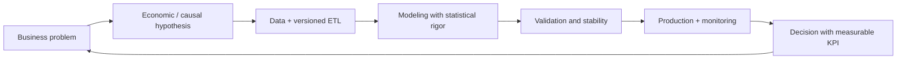

<!--
  SEO: Principal Data Scientist, Causal Inference, Econometrics, Reinforcement Learning,
  Scalable ML Systems, MLOps, Ecuador, Remote, Leadership
-->

  

<h1 align="center">👋 Hello, I'm Jordán Villón</h1>
<h3 align="center">Principal Data Scientist | Lead Data Scientist | Director of Data | Data Manager</h3>

  
  
  
  
  
  
  
  
  

---

## 💡 About Me

> My philosophy: **models do not create value on their own—decisions do.** I connect causal
> econometrics and reinforcement learning to measurable business KPIs, quantify uncertainty with
> statistical rigor, and scale teams and systems so results reach production.

I am trained in **Statistics and Mathematics**, and I work at the intersection of causal inference,
dynamic optimization, and production ML engineering. Every project I lead starts with an explicit
economic hypothesis, is validated with stability tests, and is delivered as a monitored system—
not a notebook.

---

## 🎯 Strategic Focus Areas

| Area | What I lead |
|---|---|
| **Causal Inference for Pricing & Economics** | Hedonic models, difference-in-differences, IV methods, and experiment design for pricing and policy decisions |
| **Forecasting at Scale** | Time series systems (ARIMA/SARIMA, GAMs, DL) with uncertainty quantification and conformal prediction |
| **RL for Dynamic Optimization** | PPO/DDQN agents for biosecurity, operations, and resource allocation under uncertainty |
| **ML System Design** | ETL→Feature Store→API→Dashboard architectures; drift monitoring, retraining, and governance |
| **Spatial Analytics** | H3 grids, spatial econometrics (Moran, LISA), heatmaps, and applied geostatistics |

---

## 🏆 Results with Metrics

- **Technical leadership:** I have led teams of 8+ data scientists and ML engineers, from strategic roadmapping to production delivery.
- **Production latency:** I have deployed models with **p95 latency < 80 ms** and **99.9%** availability.
- **Measurable ROI:** I delivered **+150% ROI** in a computer-vision disease detection system and **−25% pesticide usage** through early detection.
- **Early warning impact:** I detected outbreaks **7–14 days earlier** in aquaculture operations, with estimated avoided losses of **~$1.2M**.
- **Public impact:** I built governance indices covering **221 municipalities**, used by citizens, journalists, and decision-makers.
- **Valuation accuracy:** I reduced error by **18%** versus baseline hedonic models in urban valuation.

---

## 🧰 Distinctive Stack

| **Hands-on Modeling** | **Architecture / MLOps** |
|---|---|
| Python, PyTorch, scikit-learn | MLflow (experiments and model registry) |
| Statsmodels (econometrics, causality) | Databricks + Apache Spark (processing at scale) |
| LightGBM / XGBoost (quantile regression) | Airflow / versioned ETL scripts |
| Stable Baselines3 (RL) | Docker + docker-compose, CI/CD |
| Pandas / Polars / data.table | FastAPI, Redis, drift monitoring (PSI) |

---

## ⭐ Featured Projects

| Project | Visual | Problem Solved | Impact | Stack |
|---|---|---|---|---|
| [Urban Valuation Radar](https://github.com/jordanvt18/radar-valorizacion-urbana) |  | Real estate valuation forecasting for Quito and Guayaquil with confidence intervals | −18% error vs. baseline hedonic model; stronger investment decisions | Geospatial ETL (H3), LightGBM quantile, CNN+MLP, FastAPI, Leaflet/Plotly |
| [Shrimp Biosecurity AI](https://github.com/jordanvt18/bioseguridad-camaron-AI) |  | Outbreak forecasting in shrimp farms with DL+RL and an economic simulator | 7–14 day earlier alerts; ~$1.2M in avoided losses | LSTM/Transformer, Autoencoder, PPO, FastAPI, Docker |
| [Banana Disease Detection](https://github.com/jordanvt18/banana-disease-detection) |  | Banana disease detection with computer vision | +150% ROI; −25% pesticide usage; 5 s/image | PyTorch ResNet18, transfer learning, ONNX, Docker |
| [Transparency Index Ecuador](https://github.com/jordanvt18/transparency-index-ecuador) |  | Municipal transparency index and peer-comparison engine | Coverage of 221 municipalities (2025); procurement anomaly detection | ETL, composite index, FastAPI, static frontend |
| [Party Professionalization Profile](https://github.com/jordanvt18/perfil-profesionalizacion-partidos-ecuador) |  | Candidate and party professionalization index (2026 elections) | 0–100 index by candidate, party, and province; reproducible analysis | ETL, NLP, FastAPI, interactive frontend, CI/CD |
| [Python Data Processing Benchmark](https://github.com/jordanvt18/python-data-processing-benchmark) |  | Reproducible benchmark: Pandas vs. Polars vs. data.table | Empirical time and memory evidence for stack decisions | Python, notebooks, pytest |
| [Ecuador Banks & Cooperatives](https://github.com/jordanvt18/bancos-cooperativas-ecuador) |  | Financial security benchmark for banks and cooperatives | Citizen-focused financial education with auditable indicators | HTML/JS, data pipelines, GitHub Pages |
| [SmartLife Analyzer](https://github.com/jordanvt18/smartlife-analyzer) |  | Health analytics platform with model retraining | Personalized risk scoring and holdout validation | Node.js, static dashboards |
| [Ecuador Crime Analysis](https://github.com/jordanvt18/ecuador-crime-analysis) |  | Spatial and time-series crime analytics (2014–2026) | 43,976 official records; ARIMA + composite indices | Python, spatial econometrics, Dash |
| [jordanvillont.github.io](https://github.com/jordanvt18/jordanvillont.github.io) |  | Professional portfolio with case studies and demos | Executive and technical positioning | Jekyll (Minimal Mistakes), GitHub Actions |

---

## 🧭 How I Work

---

## 📫 Let's Connect

  
  
  

  <i>I build decision systems that transform uncertainty into competitive advantage.</i>

