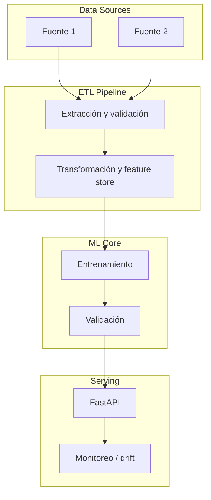

# TEMPLATE_README.md — Plantilla estándar para proyectos (estándar Senior/Head)

> Usa esta plantilla para **todo** proyecto nuevo. El objetivo es que un ejecutivo entienda el
> impacto en 30 segundos y que un científico pueda reproducir el sistema en minutos.
> Los encabezados van en inglés (estándar internacional); el contenido puede escribirse en el
> idioma del equipo, pero se recomienda inglés para visibilidad global.

---

# <Project Name>

> **Status:** `Production` · `Staging` · `Research Prototype`
> **Domain:** <industria / caso de uso>
> **Last validated:** <YYYY-MM-DD>

[]()
[]()
[]()

## 📌 Executive Summary

> Tres líneas para una audiencia ejecutiva: **qué problema** resuelve, **cómo** (enfoque) y
> **qué impacto** genera (números). Sin jerga técnica.

## 🎯 Business Impact & KPIs

| Business problem | KPI optimized | Baseline | Target | Observed |
|---|---|---|---|---|
| <problema de negocio en una frase> | <KPI: MAE, ROI, latencia, cobertura...> | <valor baseline> | <objetivo> | <resultado real o placeholder realista> |

**Por qué importa:** <1-2 frases conectando el KPI con el resultado de negocio (margen, riesgo, costo, ingresos).>

## 🧠 Methodology & Statistical Rigor

- **Hipótesis:** <hipótesis económica/científica explícita que motiva el modelo>
- **Enfoque:** <modelo(s) y por qué; identificación causal si aplica>
- **Supuestos:** <supuestos explícitos y su justificación>
- **Tests de estabilidad:** <cross-validation espacial/temporal, análisis de sensibilidad, calibración, tests de hipótesis>

### Ecuaciones clave

$$\hat{y} = f(X) \quad \text{con} \quad f \in \{\text{modelo}\}$$

<explica cada símbolo en una línea>

## 🏗️ System Architecture



## 📊 Results

| Metric | Value | Detail |
|---|---|---|
| <métrica técnica> | <valor> | <contexto: split, ventana, n> |
| <métrica de negocio> | <valor> | <contexto> |

## 🛠️ Tech Stack

| Layer | Tools |
|---|---|
| Orchestration / ETL | <Airflow, scripts, dbt, Spark...> |
| Modeling | <PyTorch, LightGBM, Statsmodels...> |
| Deployment | <FastAPI, Docker, Redis, GitHub Actions...> |

## 📂 Project Structure

```
.
├── src/               # Código de producción (ETL, modelos, API)
├── scripts/           # Utilidades y pipelines
├── tests/             # Tests (pytest)
├── data/              # raw/ y processed/ (versionados o con .gitkeep)
├── docs/              # Documentación y assets
└── config/            # Configuración (YAML, env templates)
```

## 🚀 Quick Start

```bash
git clone <url>
cd <repo>
python -m venv .venv && source .venv/bin/activate
pip install -r requirements.txt
# 1. Ejecutar ETL
python scripts/run_etl.py
# 2. Entrenar
python src/models/train.py
# 3. Servir API
uvicorn src.api.main:app --reload
```

**Requisitos:** <Python version, servicios externos (DB, redis), variables de entorno (.env.example).>

## 📈 Monitoring & Governance

- **Drift:** <PSI/KS sobre features y predicciones, ventanas de comparación>
- **Reentrenamiento:** <trigger (frecuencia, umbral de drift, calendario) y pipeline>
- **Versionado:** <datos (DVC), modelos (MLflow), código (git tags)>
- **Auditoría / Ética:** <explicabilidad (SHAP), fairness, trazabilidad de decisiones>
